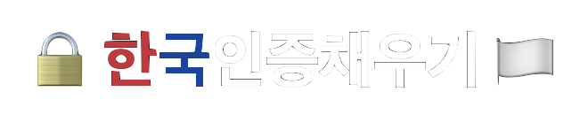
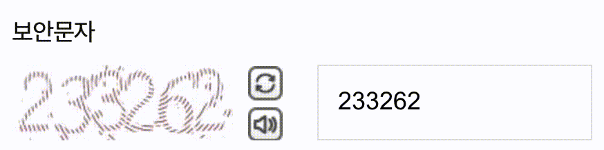

   
  
  

    대한민국 본인인증 자동 채우기 브라우저 확장 프로그램
  

## 📋 개요

한국에서 사용되는 모바일 본인인증, 휴대폰 인증, 민간인증서 인증 등을 사용할 때 필요한 정보를 자동으로 채워주는 브라우저 확장프로그램 입니다. 간단한 캡챠이미지는 비전 AI를 통해 자동으로 채워넣습니다.

## 🛠️ 기술스택

## 🚀 주요기능

### 프로필 채워넣기

사용자가 방문하는 웹페이지에서 채워넣기가 가능한 부분을 발견한 경우, 미리 설정한 프로필로 자동으로 채워넣습니다.
이 기능은 미리 설정된 프로필을 기반으로 작동하기 때문에, 사용자는 확장프로그램 팝업이나 설정페이지에서 프로필을 등록해야만 해당 기능을 사용할 수 있습니다. 지원하는 사이트와 인증업체는 [📋 지원목록](publish/지원목록.md)을 확인해주세요.

### 캡챠 자동채우기

간단한 캡챠의 경우에는 AI를 사용하여 자동으로 이미지를 인식하고 채워넣습니다. 인증회사별로 서로 다른 인식모델을 사용하고 있습니다. 자세한 사항은 [🧠 Kaptch](https://github.com/Xeonlink/kaptch)를 참고해주세요.

## 📖 설치 및 사용방법

자세한 설치 및 사용방법은 [📖 사용방법 가이드](publish/사용방법.md)를 참고해주세요.

## 📋 지원 목록

자세한 지원 목록은 [📋 지원 목록 가이드](publish/지원목록.md)를 참고해주세요.
