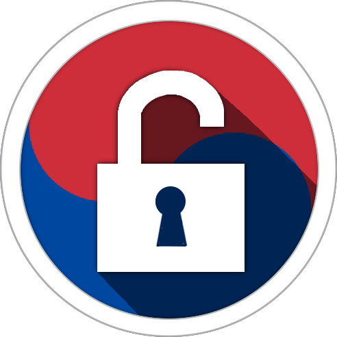
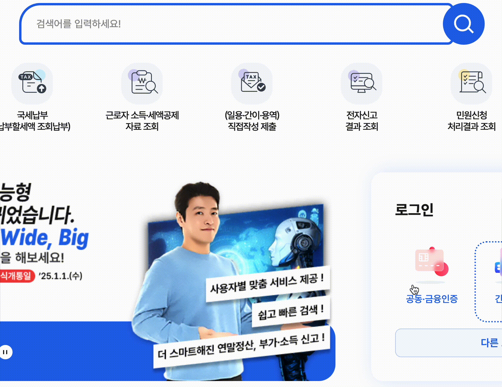
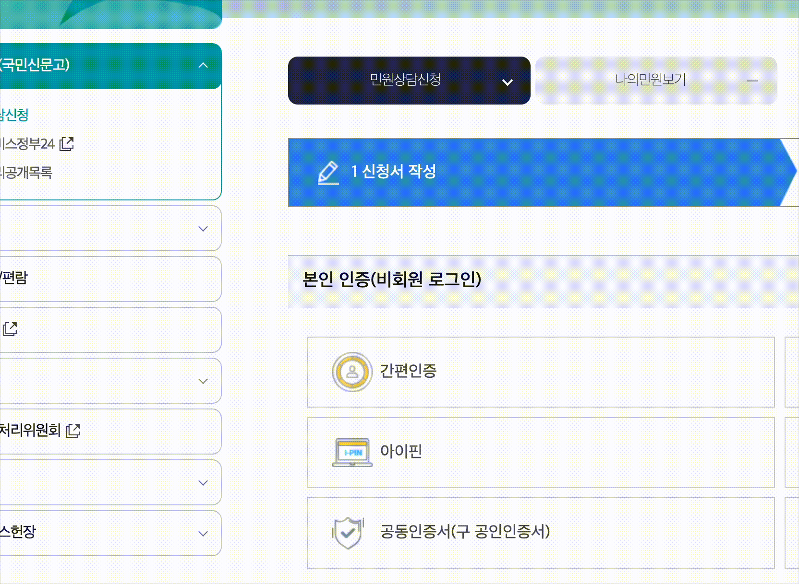

  
<h3>한국인증채우기</h3>

# 개요

한국에서 사용되는 모바일 본인인증, 휴대폰 인증, 민간인증서 인증 등을 사용할 때 필요한 정보를 자동으로 채워주는 브라우저 확장프로그램 입니다.

## 기술스택

- 
- 
- 
- 
- 

## 설치 및 사용방법

### 1. 확장프로그램 설치

[크롬 웹스토어](https://chromewebstore.google.com/detail/%ED%95%9C%EA%B5%AD%EC%9D%B8%EC%A6%9D%EC%B1%84%EC%9A%B0%EA%B8%B0/eonnjagalbjlklfjnfpgdeaajkghpnjc) 에 접속하여 크롬에 추가합니다.

### 2. 확장프로그램 고정

이 확장프로그램은 브라우저에 추가된 즉시 활성화됩니다. 확장프로그램의 채우기 기능이 실행되기 위해 사용자의 프로필 정보를 등록해야합니다. 아래는 확장프로그램의 사용을 편리하게 하기 위해 확장프로그램을 주소창 옆에 항상 표시하도록 하는 방법입니다.

1. 크롬 브라우저 오른쪽 상단에 확장프로그램 퍼즐 이미지를 클릭하여 브라우저에 추가된 확장프로그램의 목록을 표시합니다.

2. 핀 버튼을 눌러 확장프로그램을 주소창 옆에 고정시킵니다.

### 3. 프로필 추가

확장프로그램을 사용하기 위해서는 인증정보 채우기에 사용될 사용자의 정보를 프로필에 추가해야합니다. 다음은 사용자의 프로필을 추가하는 과정입니다.

주소창 옆에 고정된 확장프로그램 아이콘을 클릭하여 확장프로그램의 팝업창을 표시합니다.

프로필 추가에 사용자의 정보를 입력하고 프로필 추가 버튼을 누릅니다.

추가된 프로필을 확인합니다.

### 4. 확장프로그램 사용

이 확장프로그램은 채우기가 필요한 상황이 되면 자동으로 필요한 정보를 채워줍니다.
만약 채우기가 정상적으로 이루어지지 않는다면 다음을 확인하세요.

- 프로필이 추가되었는지 확인합니다.

- 프로필 추가 시 입력한 정보가 정확한지 확인합니다.

- 확장프로그램이 활성화되어 있는지 확인합니다.

  

  확장프로그램의 팝업창에서 확장프로그램의 ON/OFF 토글버튼을 확인합니다.

## 지원 목록

> **Note** \
> 테스트 주소는 테스트를 진행한 사이트일 뿐, 아래의 목록에 사용하고 계신 사이트가 없더라도 지원하는 모든 곳에서 채우기가 작동합니다. 만약 채우기가 작동하지 않거나, 의도하지 않은 결과로 작동한다면 [확장프로그램 지원](https://chromewebstore.google.com/detail/eonnjagalbjlklfjnfpgdeaajkghpnjc/support) 페이지로 문의해주세요.

### 1. OneAccess CX (oacx)

아래의 주소에서 테스트를 진행했습니다.

- [홈택스 로그인](https://hometax.go.kr/websquare/websquare.html?w2xPath=/ui/pp/index_pp.xml&menuCd=index3)
- [한전ON](https://online.kepco.co.kr/)
- [강원도](https://state.gwd.go.kr/portal/minwon/epeople/counsel)
- [예비군](https://www.yebigun1.mil.kr/dmobis/uat/uia/LoginUsr.do)
- [국가평생교육진흥원](https://oacx.cb.or.kr:8089/oacx/oacx.jsp)
- [특허로](https://www.patent.go.kr/smart/oacx.jsp)
- [1365자원봉사포털](https://www.1365.go.kr/vols/cmmn/oacx/popup.do)
- [서울시 민간인증서](https://www.seoul.go.kr/member/userlogin/loginCheck.do)
- [삼성서울병원 민간인증서](https://www.samsunghospital.com/home/member/login.do)

### 2. NICE 평가정보

> **Warning** \
> 마지막 페이지에서 채우기가 작동하기는 하지만 사용자의 입력이 없으면 채워진 UI가 나타나지 않습니다. 이름이 채워지고 나면 Tab을 눌러 다음 입력창으로 넘어가야 채워진 UI가 나타납니다.

아래의 주소에서 테스트를 진행했습니다.

- [서울시 모바일인증](https://www.seoul.go.kr/member/userlogin/loginCheck.do)

### 3. SCI 평가정보

아래의 주소에서 테스트를 진행했습니다.

- [대전시 모바일인증](https://www.daejeon.go.kr/integ/integNonmemberLoginProc.do?siteCd=drh&rtUrl=)

### 4. 한국모바일인증

아래의 주소에서 테스트를 진행했습니다.

- [강원도 휴대전화 인증](https://state.gwd.go.kr/portal/minwon/epeople/counsel)

### 5. 모바일 신분증

아래의 주소에서 테스트를 진행했습니다.

- [모바일 신분증](https://sp.epeople.go.kr/web/pcView)
- [강원도 모바일 신분증](https://state.gwd.go.kr/portal/minwon/epeople/counsel)

### 6. 토스 인증

아래의 주소에서 테스트를 진행했습니다.

- [디지털 원패스](https://www.onepass.go.kr/membership/find/id)
