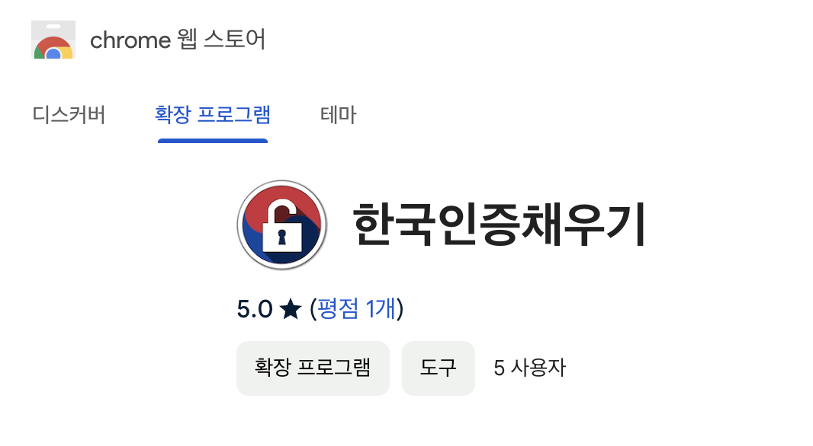
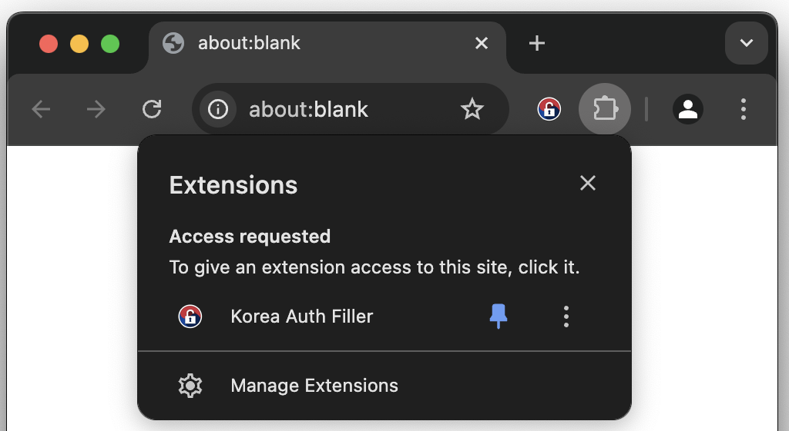
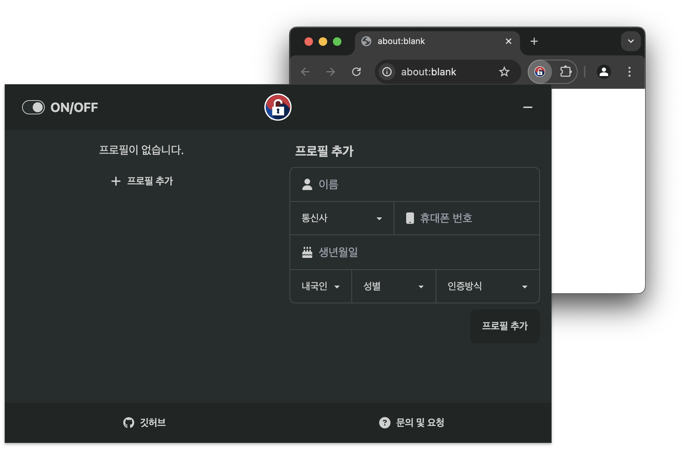
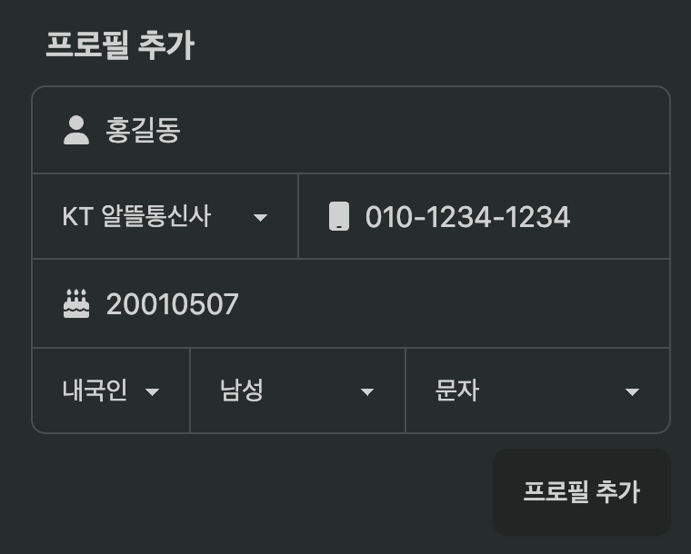

# 📦 설치 및 사용방법

## 1️⃣ 확장프로그램 설치

[크롬 웹스토어](https://chromewebstore.google.com/detail/%ED%95%9C%EA%B5%AD%EC%9D%B8%EC%A6%9D%EC%B1%84%EC%9A%B0%EA%B8%B0/eonnjagalbjlklfjnfpgdeaajkghpnjc) 에 접속하여 크롬에 추가합니다.

## 2️⃣ 확장프로그램 고정

이 확장프로그램은 브라우저에 추가된 즉시 활성화됩니다. 확장프로그램의 채우기 기능이 실행되기 위해 사용자의 프로필 정보를 등록해야합니다. 아래는 확장프로그램의 사용을 편리하게 하기 위해 확장프로그램을 주소창 옆에 항상 표시하도록 하는 방법입니다.

1. 크롬 브라우저 오른쪽 상단에 확장프로그램 퍼즐 이미지를 클릭하여 브라우저에 추가된 확장프로그램의 목록을 표시합니다.

2. 핀 버튼을 눌러 확장프로그램을 주소창 옆에 고정시킵니다.

## 3️⃣ 프로필 추가

확장프로그램을 사용하기 위해서는 인증정보 채우기에 사용될 사용자의 정보를 프로필에 추가해야합니다. 다음은 사용자의 프로필을 추가하는 과정입니다.

주소창 옆에 고정된 확장프로그램 아이콘을 클릭하여 확장프로그램의 팝업창을 표시합니다.

프로필 추가에 사용자의 정보를 입력하고 프로필 추가 버튼을 누릅니다.

추가된 프로필을 확인합니다.

## 4️⃣ 확장프로그램 사용

이 확장프로그램은 채우기가 필요한 상황이 되면 자동으로 필요한 정보를 채워줍니다.
만약 채우기가 정상적으로 이루어지지 않는다면 다음을 확인하세요.

- 프로필이 추가되었는지 확인합니다.

- 프로필 추가 시 입력한 정보가 정확한지 확인합니다.

- 확장프로그램이 활성화되어 있는지 확인합니다.

  

  확장프로그램의 팝업창에서 확장프로그램의 ON/OFF 토글버튼을 확인합니다.
