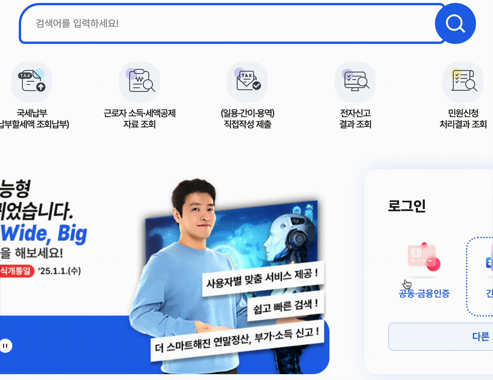
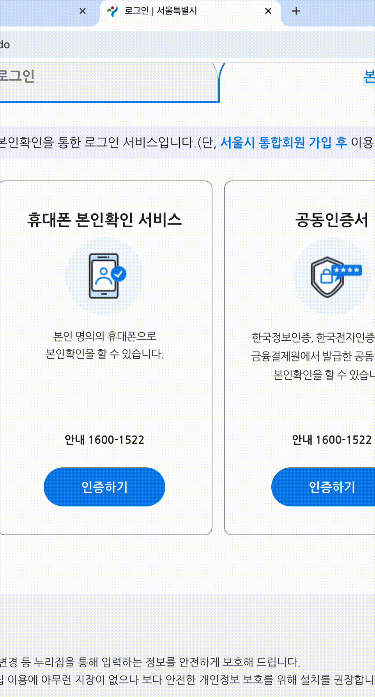
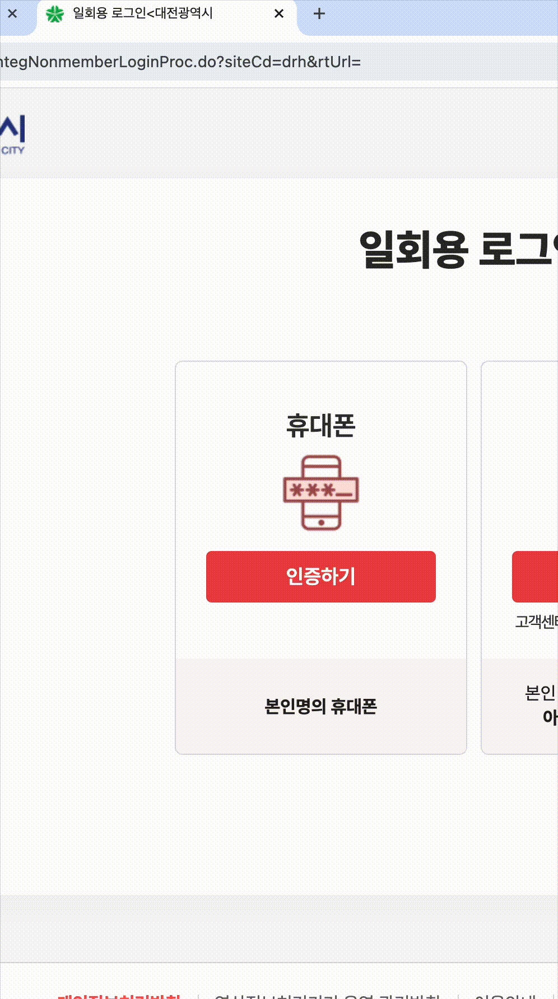
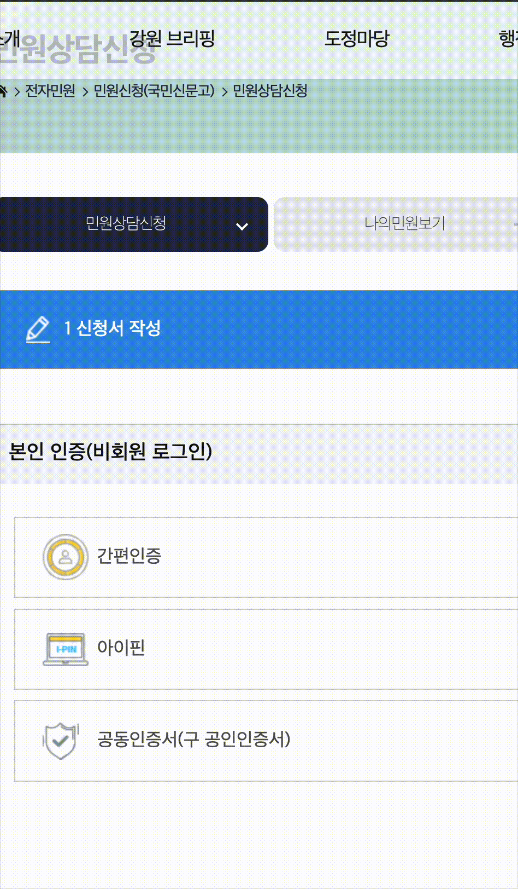
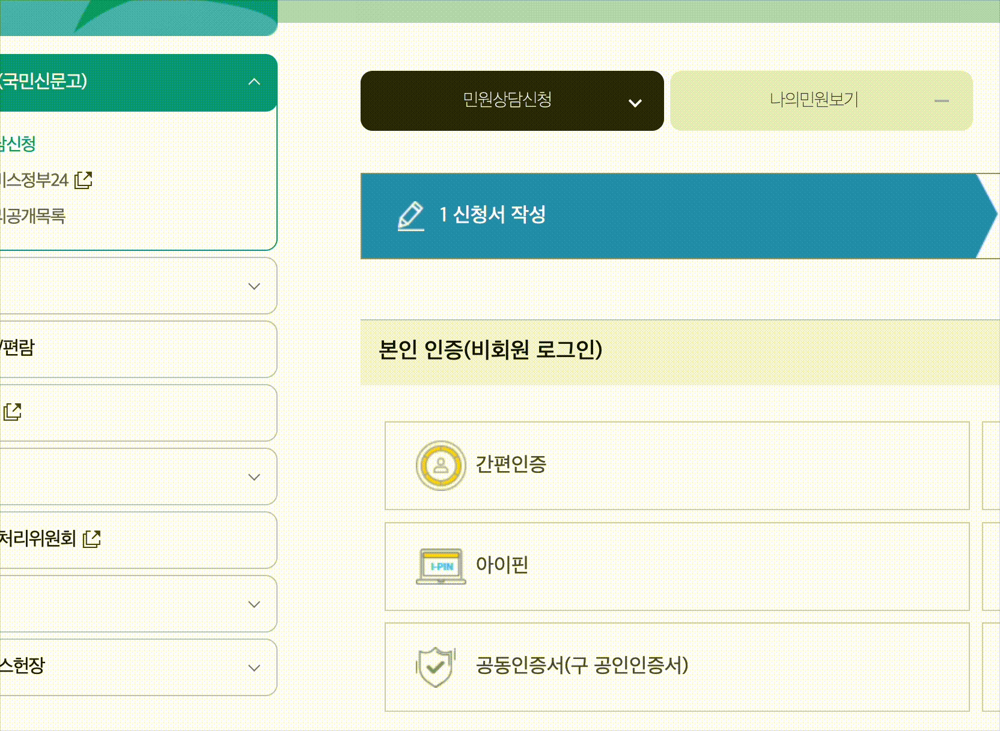
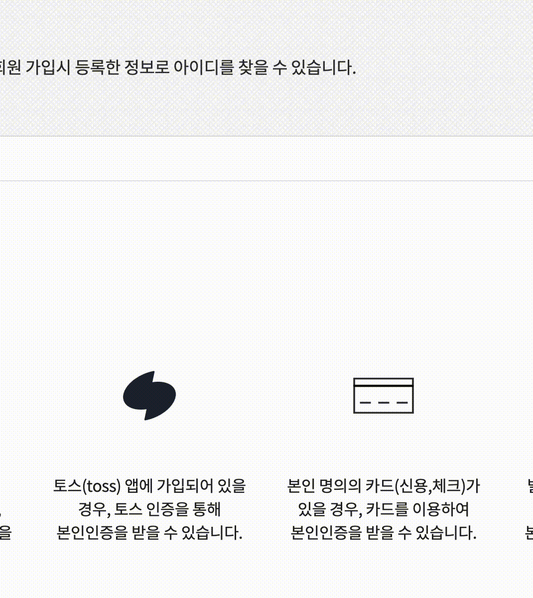

# 🎯 지원 목록

> **Note** \
> 테스트 주소는 테스트를 진행한 사이트일 뿐, 아래의 목록에 사용하고 계신 사이트가 없더라도 지원하는 모든 곳에서 채우기가 작동합니다. 만약 채우기가 작동하지 않거나, 의도하지 않은 결과로 작동한다면 [확장프로그램 지원](https://chromewebstore.google.com/detail/eonnjagalbjlklfjnfpgdeaajkghpnjc/support) 페이지로 문의해주세요.

## 1. OneAccess CX (oacx)

• [홈택스 로그인](https://hometax.go.kr/websquare/websquare.html?w2xPath=/ui/pp/index_pp.xml&menuCd=index3)
• [한전ON](https://online.kepco.co.kr/)
• [강원도](https://state.gwd.go.kr/portal/minwon/epeople/counsel)
• [예비군](https://www.yebigun1.mil.kr/dmobis/uat/uia/LoginUsr.do)
• [국가평생교육진흥원](https://oacx.cb.or.kr:8089/oacx/oacx.jsp)
• [특허로](https://www.patent.go.kr/smart/oacx.jsp)
• [1365자원봉사포털](https://www.1365.go.kr/vols/cmmn/oacx/popup.do)
• [서울시 민간인증서](https://www.seoul.go.kr/member/userlogin/loginCheck.do)
• [삼성서울병원 민간인증서](https://www.samsunghospital.com/home/member/login.do)
• [숲나들e](https://www.foresttrip.go.kr/com/login.do)
• [서울특별시 평생교육원](https://www.lllcard.kr/reg/seoul/main/crtfctPage.do)

## 2. NICE 평가정보

• [서울시 모바일인증](https://www.seoul.go.kr/member/userlogin/loginCheck.do)

## 3. SCI 평가정보

• [대전시 모바일인증](https://www.daejeon.go.kr/integ/integNonmemberLoginProc.do?siteCd=drh&rtUrl=)
• [롯데홈쇼핑 회원가입](https://www.lotteimall.com/member/regist/forward.MemberRegist.lotte)

## 4. 한국모바일인증

• [강원도 휴대전화 인증](https://state.gwd.go.kr/portal/minwon/epeople/counsel)

## 5. 모바일 신분증

• [모바일 신분증](https://sp.epeople.go.kr/web/pcView)
• [강원도 모바일 신분증](https://state.gwd.go.kr/portal/minwon/epeople/counsel)

## 6. 토스 인증

• [디지털 원패스](https://www.onepass.go.kr/membership/find/id)

## 7. KCB (한국신용정보원)

• [디지털원패스](https://www.onepass.go.kr/membership/find/id)

## 8. KMCERT (한국모바일인증)

• [강원도](https://state.gwd.go.kr/portal/minwon/epeople/counsel)
• [KT 회원가입](https://idmng.kt.com/identify/personal)
• [인터파크 티켓 아이디찾기](https://member.interpark.com/mypage/enter-identity)

## 9. NHN KCP

• [골든브라운 본인인증 샘플페이지](https://www.goldenbrown.co.kr/_api/_nhnkcp/kcpcert_api/sample/make_hash.php)
• [카페24 회원가입](https://user.cafe24.com/join/hosting/general/?page=step1&landTime=1751035289)

## 10. 드림시큐리티

• [H.Point 회원가입](https://www.h-point.co.kr/cu/join/start.nhd)
• [Make# 회원가입](https://www.makeshop.co.kr/newmakeshop/home/create_shop.html)

## 11. 다날

• [YBM어학 본인인증으로 ID찾기](https://member.ybmnet.co.kr/join/find_userid2.jsp)

## 12. 넥스원소프트

• [대한민국 국회 회원가입](https://member.assembly.go.kr/member/join/joinSelectPage.do)

## 13. KG모빌리언스

• [야놀자 회원가입](https://accounts.yanolja.com/?service=yanolja)

## 14. 페이코

• [고속도로 통행료](https://www.hipass.co.kr/comm/lginpg.do#)
• [페이코 아이디 찾기](https://www.payco.com/)
• [페이코 회원가입](https://www.payco.com/)
